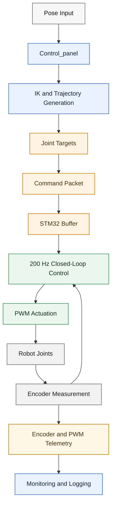

# SCI-Style Control Architecture

The following diagrams use a concise SCI-style format suitable for journal manuscripts. In this formulation, the joint values generated by `Control_panel` are used as the target commands for the low-level embedded controller.

## System Architecture

```mermaid
flowchart LR
    OP["Operator"] --> CP["Control Panel<br/>Pose Input"]

    subgraph HighLevel["Supervisory Layer"]
        CP --> IK["IK and Trajectory<br/>Generation"]
        IK --> JT["Joint Targets<br/>theta1-theta5"]
        JT --> TG["Command Packaging"]
    end

    TG --> SER["Serial Link<br/>115200 bps"]

    subgraph LowLevel["Embedded Layer (STM32)"]
        SER --> RX["Frame and Command<br/>Parsing"]
        RX --> BUF["Target Buffer"]
        BUF --> CTRL["Control Loop<br/>200 Hz"]
        CTRL --> AXIS["Five Axis Controllers"]
        AXIS --> LAW["PID-Based Control Law<br/>with Compensation"]
        LAW --> PWM["PWM Drive"]
        PWM --> ROBOT["Robot Actuation"]
        ROBOT --> ENC["Encoder Feedback"]
        ENC --> AXIS
        CTRL --> MON["Telemetry<br/>20 Hz"]
    end

    MON --> SER
    SER --> VIS["Monitoring"]
    VIS --> CP

    classDef human fill:#f7f7f7,stroke:#666666,stroke-width:1.2px,color:#111111;
    classDef high fill:#eaf2ff,stroke:#4f81c7,stroke-width:1.5px,color:#10243e;
    classDef comm fill:#fff4e5,stroke:#d28a1f,stroke-width:1.5px,color:#4d3200;
    classDef low fill:#eaf7ee,stroke:#4f9a68,stroke-width:1.5px,color:#143020;
    classDef physical fill:#f1f1f1,stroke:#7c7c7c,stroke-width:1.5px,color:#1f1f1f;
    classDef telem fill:#fff7e8,stroke:#c58a22,stroke-width:1.5px,color:#4a3208;

    class OP human;
    class CP,IK,JT,TG,VIS high;
    class SER,RX,BUF comm;
    class CTRL,AXIS,LAW,PWM,MON low;
    class ROBOT,ENC physical;

    style HighLevel fill:#f5f9ff,stroke:#8fb1de,stroke-width:1.5px,color:#1b3556
    style LowLevel fill:#f4fbf6,stroke:#8db79a,stroke-width:1.5px,color:#1a3a26
```

## Signal Flow

## Suggested Figure Caption

**Figure X.** Control architecture of the surgical robot. The `Control_panel` functions as the supervisory layer, where pose commands are converted into joint-space targets through inverse kinematics and trajectory generation. These joint targets are transmitted to the STM32-based embedded controller, which performs 200 Hz closed-loop motor control using encoder feedback and PID-based compensation. Encoder and PWM telemetry are returned to the host interface for monitoring and logging.

## Recommended Short Figure Title

**Surgical Robot Control Architecture**

## Paper-Style Terminology

- `Control_panel`: high-level supervisory controller
- `theta1-theta5`: joint-space target commands
- `STM32 controller`: low-level embedded motion controller
- `Encoder and PWM stream`: telemetry feedback channel
